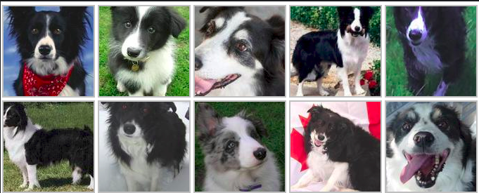
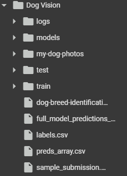

# 🐶 End-to-end Multil-class Dog Breed Classification

This notebook builds an end-to-end multi-class image classifier Using TensorFlow 2.0 and TensorFlow Hub.

Using Machine learning framework for solving classification using Tensorflow

## 1. Problem

Identify the breed of a dog given an image of a dog.

When I'm sitting  at the cafe and I take a photo of a dog, I want to know what breed of dog it is.

## 2. Data

The data we're using is from Kaggle's breed Identification competition.

https://www.kaggle.com/c/dog-breed-identification/data

## 3. Evaluation

The evaluation is a file with prediction probabilities for each dog breed of each test image

www.kaggle.com/competitions/dog-breed-identification/overview/evaluation

## 4. Features

Some information about the data:
* We're dealing with images (unstructured data) so it's probable best we use deeplearning/ transfer learning.
* There are 120 breeds of dogs (this means there are 120 different classes).
* There are around 10,00+ images in the training set (These images have labels).
* There are around 10,000 images in the test set (these images have no labelsm because we'll want to predict them).

## File Structure 

## Kaggle Current Score! (Score Range: 0-1)

